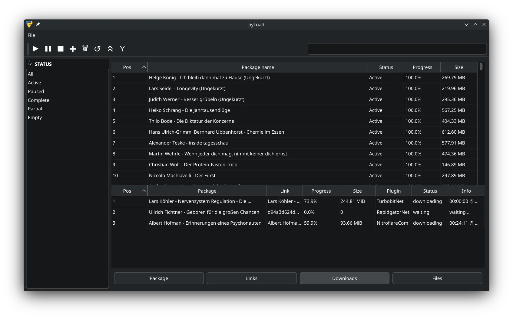

# pyload-qt

a Qt interface for [pyLoad](https://github.com/milahu/pyload),
trying to look like [qBittorrent](https://github.com/qbittorrent/qBittorrent)

## why

because the pyLoad webui fails to render 5000 packages

## screenshot

